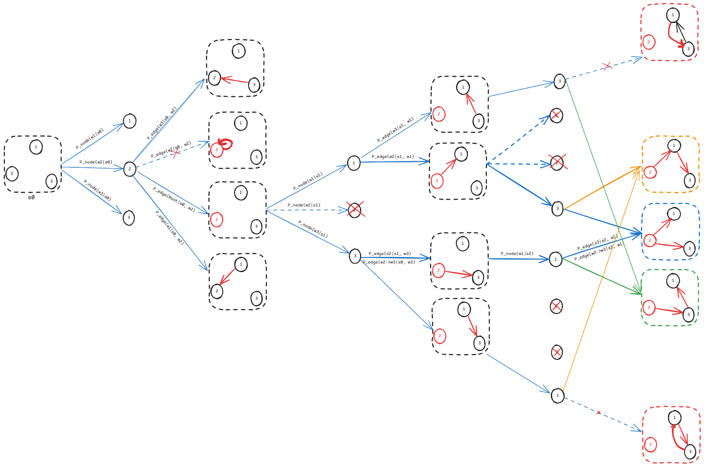

# Dependency Parsing - GFlowNet
Generative Flow Networks (GFlowNets) offer a method for sampling diverse candidates in active learning by training them to sample approximately in proportion to a given reward function. Our goal is to leverage GFlowNets to generate dependency trees sequentially (as in transition-based parsing) while preserving the structural information characteristic of graph-based approaches. This approach aims to improve dependency parsing performance and introduce a novel method for tackling this problem.

*The implementation is still in development*, but it has shown competitive performance on small datasets (i.e., datasets with short sentences). Addressing this limitation, inherent to GFlowNets, is part of our ongoing work.


## Installation
To prevent conflicts with your existing Python environment, we recommend creating a virtual environment:

```bash
conda create -n venv python=3.10
conda activate venv
# or
python -m venv venv
source venv/bin/activate

# Then install the required packages
pip install -r requirements.txt
```
Follow the JAX installation guide to install the version of JAX that corresponds to your CUDA and CuDNN versions.

## Example
This repository is currently under development using JAX to explore new ideas (a PyTorch version is available for demonstration, though it contains minor bugs). To train dp_gfn on a dataset in ConLL-U format (e.g., Universal Dependency Treebank), configure the settings in the configs file, then run:
```bash
python train.py
```

## Contact
If you're interested in this research, feel free to reach out.

## References
This code is inspired by GFlowNet works, hence I'd like to cite GFlowNet Foundations here:
```
@article{bengio2023gflownet,
  title={Gflownet foundations},
  author={Bengio, Yoshua and Lahlou, Salem and Deleu, Tristan and Hu, Edward J and Tiwari, Mo and Bengio, Emmanuel},
  journal={The Journal of Machine Learning Research},
  volume={24},
  number={1},
  pages={10006--10060},
  year={2023},
  publisher={JMLRORG}
}
```
